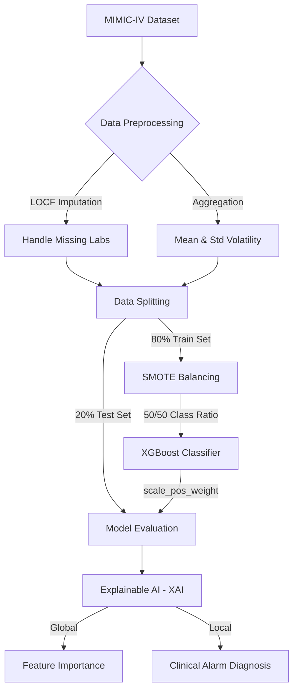

<h1 align="center">🏥 Proactive Rescue: AI-Driven Early Warning System</h1>

<p align="center">
  
  
  
  
</p>

<p align="center">
  <strong>An Explainable AI (XAI) pipeline designed to predict non-ICU clinical deterioration 6-12 hours in advance, bridging the hospital monitoring gap.</strong><br>
  Developed by <strong>Aswin VS</strong> (BT5022) | <em>Karunya Institute of Technology and Sciences</em>
</p>

---

## 📑 Table of Contents
1. [Problem Statement](#-problem-statement)
2. [The Solution](#-the-solution)
3. [Dataset & Challenges](#-dataset--challenges)
4. [Technical Architecture](#-technical-architecture)
5. [Key Findings & Explainable AI](#-key-findings--explainable-ai)
6. [How to Run](#-how-to-run)

---

## 🚨 Problem Statement
Hospitals face a dangerous **"monitoring gap"** in general wards, where patients are typically checked by nursing staff only every 4 to 8 hours. Subtle physiological declines—such as early-onset sepsis or respiratory failure—often go unnoticed between these checks, leading to "Failure to Rescue" (preventable death or emergency ICU transfers). Current manual scoring systems are reactive and frequently trigger too late.

## 💡 The Solution
This project develops an AI-powered **"Predictive Smoke Alarm."** By analyzing the last 24 hours of a patient's physiological trends, the model predicts the probability of a life-threatening event 6 to 12 hours before it occurs, providing a critical **"Golden Window"** for clinical intervention.

---

## 📊 Dataset & Challenges
This project utilizes the **MIMIC-IV v2.2 Demo Dataset**, a de-identified electronic health record (EHR) database from the Beth Israel Deaconess Medical Center.

* **Severe Class Imbalance:** 94.5% of patients (260) are stable, while only 5.5% (15) experienced deterioration.
* **Data Sparsity:** Irregular sampling intervals for laboratory tests necessitated Last Observation Carried Forward (LOCF) imputation.
* **The Accuracy Paradox:** Standard models achieved high accuracy by ignoring the minority class (0% Recall). This was mitigated using **SMOTE** (Synthetic Minority Over-sampling Technique).

---

## ⚙️ Technical Architecture

The pipeline processes raw, irregular clinical time-series data, balances the training space, and applies cost-sensitive gradient boosting.


---

## 📈 Key Findings & Explainable AI

### Performance Comparison
Because missing a deteriorating patient is clinically costly, the XGBoost model was optimized for sensitivity using `scale_pos_weight=20`. 

| Metric | Baseline (Logistic Reg) | Improved (XGBoost) | Clinical Impact |
| :--- | :--- | :--- | :--- |
| **Overall Accuracy** | 64.0% | **71.0%** | +7.0% Overall Correctness |
| **Class 1 Recall** | 33.0% | **33.0%** | Both identified critical deterioration events |
| **Class 1 Precision**| 5.0% | **7.0%** | XGBoost marginally reduced false alarms |
| **ROC-AUC Score** | **0.5897** | 0.5705 | Linear model ranked probabilities slightly better |

*Note: The extreme size restriction of the test cohort (only 3 true positive cases) limits the mathematical divergence between models.*

### Explainable AI (XAI) Focus
To combat "Alarm Fatigue" in clinical settings, the model does not just output a risk score; it provides the actionable *cause*.
* **Global XAI:** Feature importance revealed that **Heart Rate Volatility (Std)** drives ~57% of the model's decision-making, compared to 43% for Mean Heart Rate. *Conclusion: Physiological instability is a stronger predictor than static averages.*
* **Local XAI:** The system generates a Patient-Specific Diagnosis (e.g., *“Target Patient Index 3: 88.62% Risk. CAUSE: Physiological Instability”*), giving nurses immediate context for bedside review.

---

## 🚀 How to Run

1. **Clone the repository:**
   ```bash
   git clone https://github.com/YourUsername/YourRepositoryName.git
   ```
---

## 🛠️ Requirements & Dependencies
This project requires Python 3.8+ and the following core libraries. If you are using Google Colab, most of these are pre-installed.
* `pandas` & `numpy` (Data manipulation)
* `scikit-learn` (Baseline modeling, scaling, and evaluation metrics)
* `xgboost` (Advanced non-linear gradient boosting)
* `imbalanced-learn` (SMOTE implementation for class balancing)
* `matplotlib` & `seaborn` (Data visualization)

---

## 📂 Project Structure
```text
Proactive-Rescue-AI/
│
├── Final.ipynb                   # Main executable Jupyter/Colab Notebook containing the full pipeline
├── Final_Submission_Report.pdf   # Comprehensive project documentation and clinical analysis
├── README.md                     # Project overview and repository guide
│
└── Dataset-MIMIC_IV/             # (Cloned automatically during script execution)
    ├── admissions.csv.gz         # Patient admission and outcome data
    ├── chartevents.csv.gz        # High-frequency vital signs (Heart Rate, SpO2)
    └── labevents.csv.gz          # Low-frequency biomarkers (Lactate)
```
