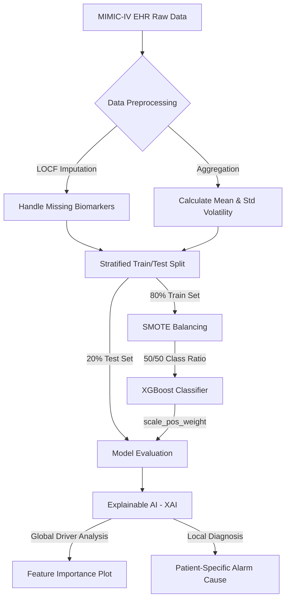

# 🏥 Proactive Rescue: AI-Driven Early Warning System 

An Explainable AI (XAI) pipeline designed to predict non-ICU clinical deterioration 6–12 hours in advance, bridging the hospital monitoring gap. 

---

## 📑 Table of Contents
1. [Problem Statement](#-problem-statement)
2. [The Solution](#-the-solution)
3. [Dataset & Clinical Challenges](#-dataset--clinical-challenges)
4. [Technical Architecture](#-technical-architecture)
5. [Key Findings & Explainable AI](#-key-findings--explainable-ai)
6. [How to Run](#-how-to-run)
7. [Author](#-author)

---

## 🚨 Problem Statement
Hospitals face a dangerous **"monitoring gap"** in general wards, where patients are checked by nursing staff only every 4 to 8 hours. Subtle physiological declines—such as early-onset sepsis or respiratory failure—often go unnoticed between these checks, leading to "Failure to Rescue" (preventable death or emergency ICU transfers). 

## 💡 The Solution
This project develops an AI-powered **"Predictive Smoke Alarm."** By analyzing the last 24 hours of a patient's physiological trends, the model predicts the probability of a life-threatening event providing a "Golden Window" for proactive clinical intervention.

---

## 📊 Dataset & Clinical Challenges
This project utilizes the **MIMIC-IV v2.2 Demo Dataset**, a de-identified electronic health record (EHR) database.

* **Severe Class Imbalance:** 94.5% of patients are stable, while only 5.5% experienced deterioration.
* **Data Sparsity:** Irregular sampling intervals for laboratory tests necessitated Last Observation Carried Forward (LOCF) imputation.
* **The Accuracy Paradox:** Standard models achieved high accuracy by completely ignoring the minority class. This was resolved using **SMOTE** (Synthetic Minority Over-sampling Technique).

---

## ⚙️ Technical Architecture

The pipeline processes raw clinical time-series data, balances the training space, and applies cost-sensitive gradient boosting.

    class A,E,H primary;
    class G,F highlight;
    class J,K outcome;
